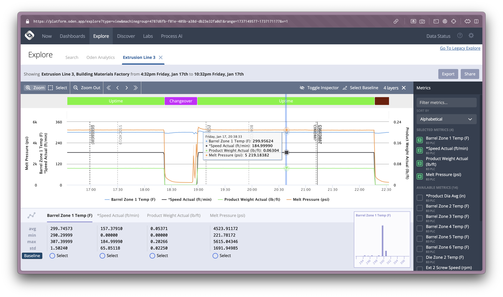
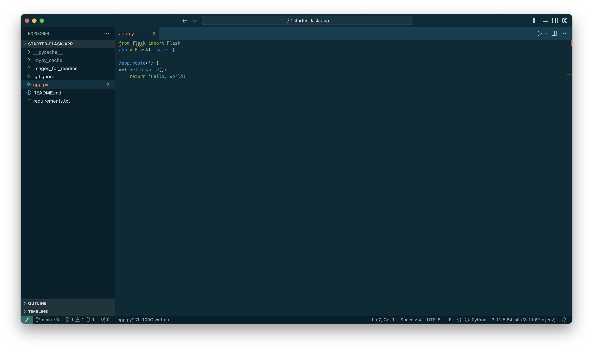
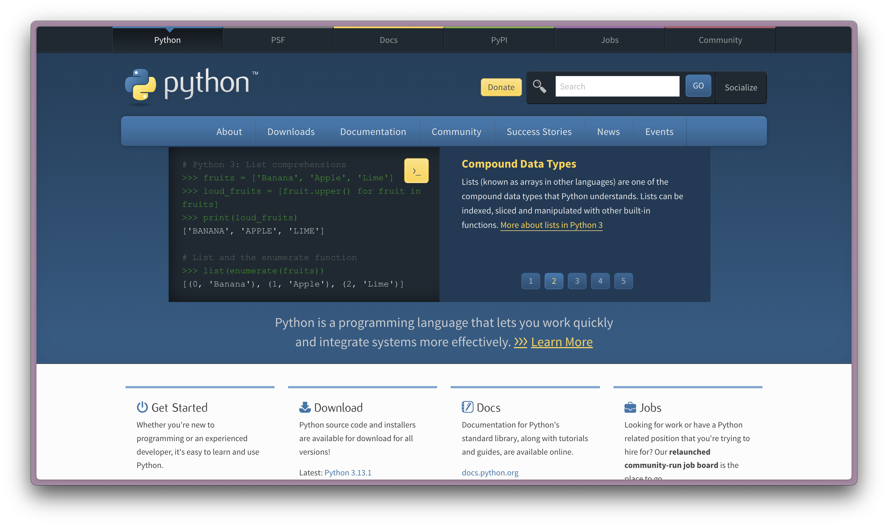
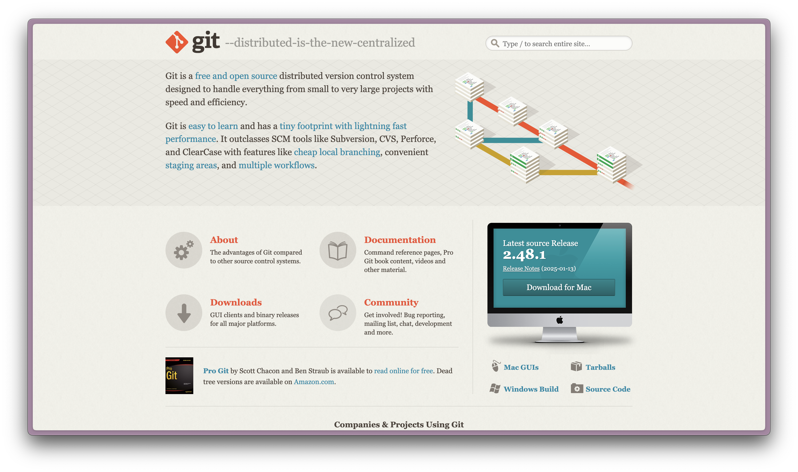
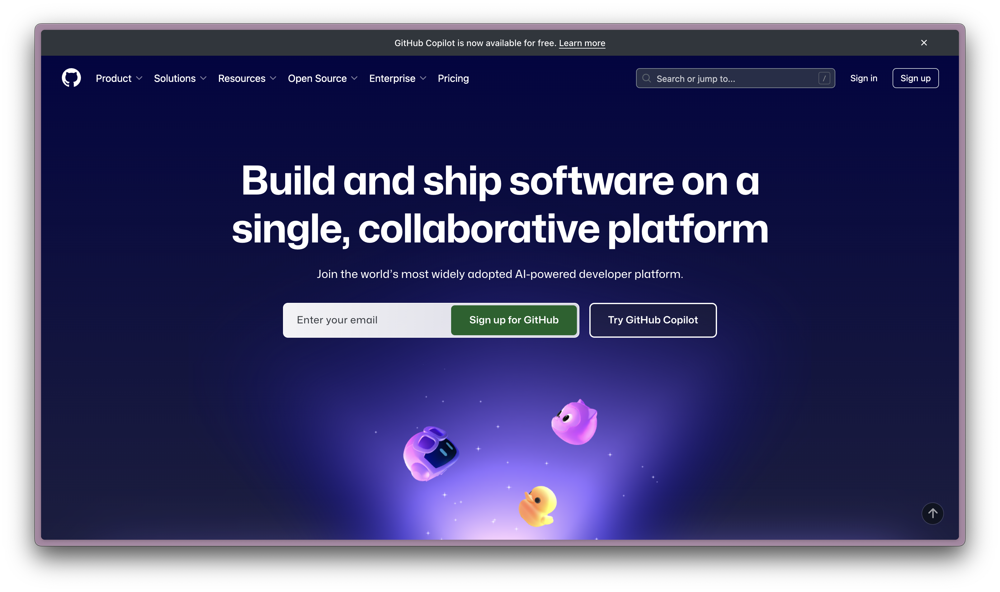

# Data Science
# &
# Machine Learning 2

## Instructor: Devon Peticolas
## `BIGD204`

---
layout: center
transition: fade
---

# What is this Class?

 

> The power of data science and machine learning can change the world. From voice activation to video game programming to advancements in medical science - the possibilities for activation are endless. Through this advanced course, students will leverage their foundational knowledge of Python to develop a more sophisticated programming skill set. Further, students will use a variety of mathematical techniques (statistics, linear algebra, and probability) to analyze data and create impactful visualizations. By course completion, students will become well-versed in a range of strategies and techniques in both data science and machine learning and become data-driven decision makers. Further, students will be able to apply communication skills and fairness frameworks to identified solutions, making them invaluable assets to any future data science/machine learning classroom, or future employer. 

---
layout: center
---

# What is this Class?

 

1. We're going to talk a lot about Data Science and Machine Learning.
2. We're going to build our Python skills.
3. We're going to build our statistics fundamentals.
4. We're going to learn Data Science tequniques.
5. We're going to learn Machine Learning.
6. We're going to learn about AI.

---
layout: image-right
image: decks/01_introduction/devon_pic.jpg
---

# About Me

- **Mr. Peticolas** (Mr. P)
- I've worked at startups on Data Science teams for 12 years.
- I'm a Data Scientist at [Oden Technologies](https://oden.io/) where we employ DS & ML for manufacturing.
- This is my **second** time teaching at Columbia and my **first** time over Zoom.
- This photo was AI generated

---
layout: center
---

---

# Learning Objectives

1. **Apply** data science skills using real-world data to **create** meaningful, interactive applications addressing authentic problems.

2. **Analyze** and **implement** practical machine learning approaches to **solve** real-world problems, emphasizing pragmatic solutions over deep theory.

3. **Examine** and **employ** large language models (LLMs) to **enhance** data-driven applications.

---
layout: center
---

# Subjects

---
layout: image-right
image: decks/01_introduction/image-1.png
---

# Python

- **What is Python?**
  - A versatile, high-level programming language
- **Key Features**
  - Simple syntax, readability, extensive libraries
- **Why Python for Data Science and AI?**
  - Flexibility and strong community support
- **Use Cases**
  - Web development, automation, data analysis, machine learning

---
layout: image-right
image: decks/01_introduction/18th_century_crime_statistics.jpg
---

# Data Science

- **Definition**
  - The science of extracting insights from data
- **Key Components**
  - Data collection, cleaning, analysis, visualization
- **Tools and Technologies**
  - Python, R, SQL, Tableau
- **Applications**
  - Business intelligence, healthcare, finance, marketing

---
layout: image-right
image: decks/01_introduction/image-2.png
---

# Machine Learning

- **What is Machine Learning?**
  - A subset of AI focused on building systems that learn from data
- **Types of Learning**
  - Supervised, Unsupervised, Reinforcement
- **Common Algorithms**
  - Linear Regression, Decision Trees, Neural Networks
- **Real-World Examples**
  - Recommendation systems, image recognition, natural language processing

---
layout: image-right
image: decks/01_introduction/image-3.png
transition: fade
---

# Artificial Intelligence (AI)

- **Definition**
  - The simulation of human intelligence in machines
- **Large Language Models (LLMs)**
  - A subset of deep learning that understands and generates text
- **Applications of LLM-base AI**
  - Chatbots, content generation, language translation, data enrichment

---
layout: image-right
image: decks/01_introduction/image-4.png
---

# Artificial Intelligence (AI)

- **Definition**
  - The simulation of human intelligence in machines
- **Large Language Models (LLMs)**
  - A subset of deep learning that understands and generates text
- **Applications of LLM-base AI**
  - Chatbots, content generation, language translation, data enrichment

---
layout: center
---

_"Tell me and I forget. Teach me and I may remember. Involve me and I learn."

— Benjamin Franklin

---

# Projects

**Project 1 - Bluesky Sentiment Analysis**
  - **Format**: Jupyter Notebook
  - **Task**: Perform sentiment analysis on a subset of the Bluesky dataset.

**Project 2 - Data Science Web App**
  - **Format**: Data Science Web App (Flask)
  - **Task**: Build an interactive web app that visualizes or performs analysis on a chosen dataset.

**Project 3 - Free-form LLM App**
  - **Format**: Open ended python application
  - **Task**: Build a _____ that utilizes an LLM to generate, annotate, or guide the experience.

---
layout: two-cols
---

# Section 1

## Week 1: Introductions, Python Refresher, and Setup
- **Introductions & Class Overview**
- **Python Refresher**

## Week 2: Data Foundations & Basic Stats
- **Data History & Data Today**
- **Basic Statistics for Data Science**
- **Pandas Fundamentals**

::right::

## Week 3: Kinds of Data & Data Visualization
- **Kinds of Data**
- **Data Visualization**

## Week 4: Introduction to NLP & Project 1 Review
- **NLP Basics**
- **NLP with SpaCy**
- **Homework:** Project 1 - NLP

---
layout: two-cols
---

# Section 2

## Week 5: Supervised ML & Launch Project 2
- **Project 1 Discussion and Recap**
- **Supervised ML**
- **Machine Learning with SciPy**

::right::

## Week 6: Unsupervised ML & Feature Engineering
- **Feature Engineering**
- **Unsupervised ML**

## Week 7: Simple Neural Networks & Project 2 Review
- **Simple Neural Networks**
- **Training Neural Networks with PyTorch**
- **Homework:** Project 2 - Web App

---
layout: two-cols
---

# Section 3

## Week 8: Advanced Neural Networks
- **Review Project 2 Submissions**
- **Convolutional Neural Networks (CNNs)**
- **RNNs and LSTMs**
- **Class Discussion**

::right::

## Week 9: Large Langua- **How an LLM Works*j
- **How an LLM Works**
- **Prompt Engineering**
- **Employing LLMs with Langchain**
- Project 3 – LLM-based Application

## Week 10: Final Presentations, Ethics, and Next Steps
- **Final Project Demos**
- **Ethics & Industry Insights**
- **Wrap-Up & Celebration**

---
layout: image-right
image: decks/01_introduction/image-11.png
---

# Tools for the Job

- **A Computer:** Windows, macOS, or Linux

- **Visual Studio Code:** Primary code editor.

- **Python (3.x):** Our primary programming language.

- **Git:** For accessing and sharing code.

- **GitHub Account:** For storing and sharing projects.

---
layout: image-right
image: decks/01_introduction/image-13.png
---

# What kind of computer do you have?

## 👍 Windows

 

## ❤️ Mac

 

## 🎉 Linux

---
layout: image-right
image: decks/01_introduction/image-11.png
---

# Python on Windows

- The industry choice for traditional businesses.
- Requires downloading Python from python.org.
- May need to manually add Python to the PATH environment variable.
- Integrated development environments (IDEs) like PyCharm, VS Code, or IDLE work seamlessly.
- Supports package installation via pip in Command Prompt or PowerShell.
- Virtual environments can be a pain.

---
layout: image-right
image: decks/01_introduction/image-14.png
---

# Python on Mac

- The industry choice for startups and small tech business.
- Pre-installed Python versions - usually outdated.
- Install the latest version using Homebrew (`brew install python`).
- Terminal is very similar to Linux.
- IDEs and editors like PyCharm, VS Code, Vim, and Emacs are widely supported.
- Virtual environment tools (`venv`) work well with minimal setup.

---
layout: image-right
image: decks/01_introduction/image-15.png
---

# Python on Linux

- Popular in academia, open source industry, and the most popular server choice.
- Most distributions include Python pre-installed (often Python 3).
- Install or update via package manager (`apt`, `yum`, or `dnf`).
- Command-line tools are deeply integrated.
- IDEs and editors like PyCharm, VS Code, Vim, and Emacs are widely supported.
- Virtual environment management is straightforward using `venv`.

---
layout: center
---

<footer class="absolute bottom-0 left-0 right-0 p-2">https://code.visualstudio.com/</footer>

---
layout: center
---

<footer class="absolute bottom-0 left-0 right-0 p-2">https://www.pythonb.org/</footer>

---
layout: center
---

<footer class="absolute bottom-0 left-0 right-0 p-2">https://git-scm.com/</footer>

---
layout: center
---

<footer class="absolute bottom-0 left-0 right-0 p-2">https://github.com/</footer>

---

# Reading Materials

_All reading material for this class is freely available online._

-	‘A Byte of Python’

    https://python.swaroopch.com/

-	‘Think Stats, 2nd Edition’

    https://greenteapress.com/thinkstats2/html/index.html

-	‘An Introduction to Statistical Learning, with Applications in Python’

    https://hastie.su.domains/ISLP/ISLP_website.pdf.download.html

---

# Example Class Structure
*Work in Progress*

- 1:00 to 1:10pm (10m) - Do Now
- 1:10 to 1:40 (30m) - Lecture
- 1:40 to 1:45 (5m) - Break
- 1:45 to 2:15 (30m) - Lecture or Activity
- 2:15 to 2:20 (5m) - Break
- 2:20 to 2:50 (30m) - Lecture or Activity
- 2:50 to 3:00 (10m) - Wrap Up

---
layout: center
---

# Let's Collect Some Data

 

## `https://shorturl.at/sT0CF`

---
layout: center
---

# Ice Breaker

 

Pick on question from the form and explain your answer.

---
layout: center
---

# Let's explore the data