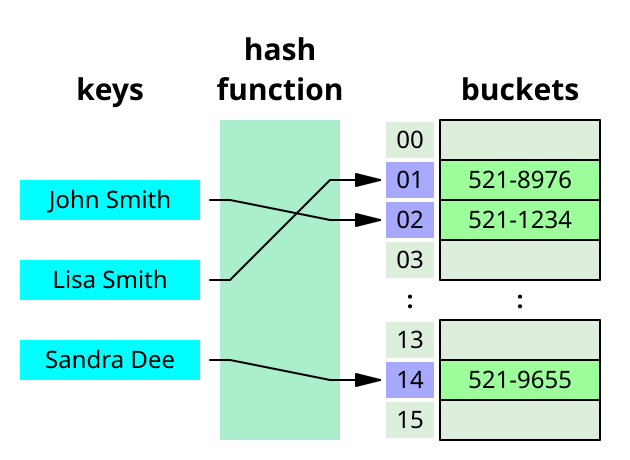

# Python Objects

---
layout: two-cols-header-2
---

## Data Structures and Objects

::left::

### Data Structures
- Specialized way of organizing and storing data.
- Make it easier to access, modify, and manage data.
- Examples: lists, stacks, queues, dictionaries, trees, graphs.



::right::

### Objects
- Fundamental building blocks in many programming languages.
- Represent specific “instances” that encapsulate both data and behavior.
- In Python, everything is an object (`int`, `str`, `list`, `dict`, etc.).

```python
class dict:
    def __init__(self):
        ...
    
    def get(self, key):
        ...
    
    def set(self, key, value):
        ...
```

---

## List

Ordered, mutable, and can contain mixed types.

```python {monaco-run} {autorun: false}
my_list = [1, 2, 3, 4, 5]

third = my_list[3]
print("third", third)

last = my_list[-1]
print("last", last)

first_three = my_list[0:3]
print("first three", first_three)

my_list[0] = 6
print("after change", my_list)
```

---

## List Methods

```python {monaco-run} {autorun: false}
my_list = [1, 2, 3, 4, 5]

my_list.append(6)
print("after append", my_list)

my_list.remove(2)
print("after remove", my_list)

popped = my_list.pop() 
print("after pop", my_list)
print("pop value", popped)

length = len(my_list)
print("length", length)
```
---
layout: two-cols
---

## Functions
- **Independent:** Functions are standalone blocks of code that can be called from anywhere in your program.
- **Defined with def:** They are defined using the def keyword, followed by a name, parentheses for parameters (if any), and a colon.

```python
def greet(name):
  print("Hello, " + name + "!")

greet("Alice")  # Output: Hello, Alice!
```

::right::

## Methods
- **Associated with objects:** Methods are functions that are associated with a specific object or class.
- **Called using dot notation:** They are called using the object or class name, followed by a dot, and then the method name.

```python
class Dog:
  def bark(self):
    print("Woof!")

my_dog = Dog()
my_dog.bark()  # Output: Woof!
```

---

## Iterating a List

```python {monaco-run} {autorun: false}
my_list = [10, 20, 30]

## Index-based iteration
for i in range(len(my_list)):
    print(my_list[i])

## Direct iteration
for element in my_list:
    print(element)
```

---

## List Comprehensions

These are a very "Pythonic" way to build lists with concise syntax.

```python {monaco-run} {autorun: false}
squares = [x**2 for x in range(10)]
even_squares = [x**2 for x in range(10) if x % 2 == 0]

matrix_values = [
    i*10 + j
    for i in range(5)
    for j in range(10)
]
print(matrix_values)
```

---

## Lists of Lists (2D-Array)

Lists can contain other lists to create 2D arrays (or even higher dimensions).

```python {monaco-run} {autorun: false}
matrix = [[1, 2, 3], [4, 5, 6], [7, 8, 9]]
print(matrix[0])
print(matrix[1][2])

for row in matrix:
    for element in row:
        print(element)
```

---

## Strings

Strings in Python are immutable (similar to Java and JavaScript). They are sequences of characters.

```python {monaco-run} {autorun: false}
my_string = "Hello, World!"

lowered = my_string.lower()
print("lowered", lowered)

sliced = my_string[0:5]
print("sliced", sliced) 

split = my_string.split()
print("split", split) 

replaced = my_string.replace('Hello', 'Goodbye')
print("replaced", replaced) 
```

---

## Iterating Over a String

In Python, strings can be iterated over just like lists.

```python {monaco-run} {autorun: false}
for char in "Hello":
    print(char)
```

---

## Tuple

Tuples are like lists, but they’re **immutable**. They’re often used for fixed collections of items or for returning multiple values.

```python {monaco-run} {autorun: false}
my_tuple = (1, 2, 3, 4, 5)

print(my_tuple[0])
print(my_tuple[3])
```

---

## Tuple Assignment

Python lets you return multiple values from a function and “unpack” them easily.

```python {monaco-run} {autorun: false}
def below_and_above(values, split):
    above = []
    below = []
    for val in values:
        if val < split:
            below.append(val)
        else:
            above.append(val)
    return below, above

below_nums, above_nums = below_and_above([5,6,3,9,2,1,7,8], 4)
print(below_nums)
print(above_nums)
```

---

## Enumerate

`enumerate` generates pairs (index, value), so you don't have to choose between iterating by index or by element.

```python {monaco-run} {autorun: false}
my_list = ['a', 'b', 'c']
for i, val in enumerate(my_list):
    print(f"Index: {i}, Value: {val}")
```

---

## Dictionary

Python dictionaries are **key-value** stores, somewhat like Java `Map` or JS `Object` (but more powerful).

```python {monaco-run} {autorun: false}
my_dict = {'name': 'Alice', 'age': 25}
print(my_dict['name'])

my_dict['email'] = 'alice@example.com'
del my_dict['age']

print(list(my_dict.keys()))
print(list(my_dict.values()))
print(list(my_dict.items()))

print(my_dict.get('name'))
print(my_dict.get('address'))
print(my_dict.get('address', 'NYC'))
```

---

## Iterating Over a Dict

```python {monaco-run} {autorun: false}
my_dict = {'a': 1, 'b': 2, 'c': 3}
for key, value in my_dict.items():
    print(f"key is {key} and value is {value}")
```

---

## A Brief Aside About Mutation

Some Python data structures are mutable (e.g. lists, dicts) while others are immutable (e.g. strings, tuples).

```python {monaco-run} {autorun: false}
my_list = [1, 2, 3]
my_list[0] = 4
print(my_list)

my_tuple = (1, 2, 3)
my_tuple[0] = 4
```

---

## A Brief Aside About Mutation (Cont.)

Immutable objects (like tuples) can safely be used as dictionary keys. If they were mutable, keys could silently change, causing major confusion.


```python
key_1 = (1, 2)
key_2 = (3, 2)
my_dict = {key_1: 'a', key_2: 'b'}

key_2[0] = 1
```

---

## Lists of Dicts and Dicts of Lists

You can nest these structures to represent more complex data.

```python {monaco-run} {autorun: false}
people = [
    {'name': 'Alice', 'age': 25},
    {'name': 'Bob', 'age': 30}
]

my_dict = {
    'Mr. P': {
        'favorite_music': 'LCD Soundsystem',
        'favorite_movie': 'Ponyo'
    },
    'Student': {
        'favorite_music': 'The Beatles',
        'favorite_movie': 'The Matrix'
    }
}
print(my_dict["Mr. P"]["favorite_music"])
print(my_dict["Student"]["favorite_movie"])
```

---

## Converting Between Data Structures

Dictionary to List
```python {monaco-run} {autorun: false}
my_dict = {'a': 1, 'b': 2, 'c': 3}
print(list(my_dict)) 
print(list(my_dict.items()))
```

List of Tuples to Dictionary
```python {monaco-run} {autorun: false}
my_list = [('a', 1), ('b', 2), ('c', 3)]
print(dict(my_list))
```

List to Tuple
```python {monaco-run} {autorun: false}
my_list = [1, 2, 3]
print(tuple(my_list)) 
```

---

## Membership Operators

- `in` : Evaluates to true if it finds a variable in the specified sequence
- `not in` : Evaluates to true if it does not find a variable in the specified sequence

### Example

It works in strings and lists
```python {monaco-run} {autorun: false}
print('a' in 'banana')
print('seed' not in 'weed')
print('a' in ['b', 'a', 'n', 'a', 'n', 'a'])
```

---

## Identity Operators

- `is` : Evaluates to true if the variables on either side of the operator point to the same object
- `is not` : Evaluates to true if the variables on either side of the operator do not point to the same object

```python {monaco-run} {autorun: false}
foo = "hello world"
bar = "hello world"
print(foo == bar)
print(foo is bar)
```

```python {monaco-run} {autorun: false}
foo = ["h", "e", "l", "l", "o"]
bar = ["h", "e", "l", "l", "o"]
print(foo == bar)
print(foo is bar)
```

---

## There are Many More Data Structures

- **Sets** - Like lists, but with unique items (similar to Java’s `HashSet`).
- **Graphs** - Networks of nodes and edges.
- **Trees** - Hierarchical data (file systems, decision trees).
- **Heaps** - Priority queues.
- **And more...**

*These advanced structures typically build on the basics you’ve learned here. Python’s flexibility with lists, dicts, and tuples will cover a huge portion of your data structure needs—especially in data science work with libraries like Pandas and scikit-learn.*