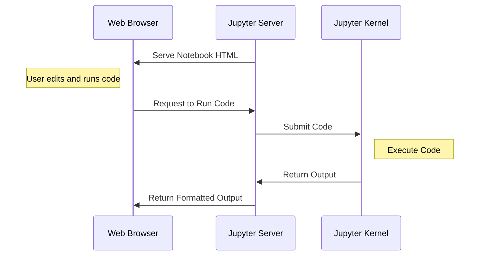

# Jupyter Notebooks

---
layout: image-right
image: decks/04_jupyter_notebooks/image-1.png
---
## Jupyter Notebooks

- The Jupyter Notebook is an open source web application that you can use to create and share documents that contain live code, equations, visualizations, and text.
- Jupyter Notebook is maintained by the people at Project Jupyter.
- It's a python package that can be installed using pip.
- It's very popular among data scientists and machine learning engineers.

---

---
layout: image-right
image: decks/04_jupyter_notebooks/image-6.png
backgroundSize: contain
---
## Cell Types

- Code Cells: Contains code that can be executed.
- Markdown Cells: Contains text, images, and equations.
- Raw Cells: Contains raw text that is not rendered.

---
layout: image-right
image: decks/04_jupyter_notebooks/image-5.png
backgroundSize: contain
---

## Running Cells

- A Notebook is a collection of cells.
- Each cell can contain code, text, or images.
- You can run a cell by clicking the "Run" button or pressing `Shift + Enter`.
- The output of the cell will be displayed below it.

**The state of the kernel is maintained between cells.**

_This creates unintuitive behavior when cells are run out of order._

---
layout: image-right
image: decks/04_jupyter_notebooks/image-8.png
backgroundSize: contain
---

## Google Colab

- Google Colab is a free cloud service that allows you to run Jupyter Notebooks.
- Notebooks are stored in Google Drive.
- Access is free via Columbia University.
- It's a great way to run machine learning models without having to worry about hardware.

### https://colab.google/

---
layout: section
hideInToc: true
---

# DEMO

---
layout: image-right
image: decks/04_jupyter_notebooks/5d0f97cb-0e2e-49e6-b273-e75ae7ac9ecc.webp
---

## Breakout

We're going to break into 3 groups to pair program.

### The Car

- **Driver**: Shares their screen and types
- **Navigator**: Guides the driver
- **DJ**: Takes notes, catches bugs ✨ _manages the vibe_ ✨

*At the end of the session **two groups** will present their code.*

### `shorturl.at/kD6FL`