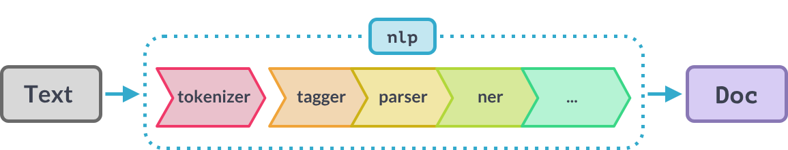

# Natural Language Processing

<!-- TODO: Reorganize these slides so SpaCy stuff is all together. -->

---
layout: quote
---

> **Natural Language Processing (NLP)** is an interdisciplinary subfield of computer science and artificial intelligence. It is primarily concerned with enabling computers to process data encoded in natural language. NLP is closely related to information retrieval, knowledge representation, and computational linguistics—a subfield of linguistics.

---

## Applications of NLP in Real-World Scenarios

- Language translation (e.g., Google Translate).
- Filtering internet hate speech, fake news, and spam.
- Content recommendation systems.
- *A component of* text-completion suggestions (e.g., autocomplete).
- *A component of* language processing and auto-captioning.
- *A component of* large language models (LLMs), such as ChatGPT.

---

## Popular NLP Libraries

**NLTK**:
- Natural Language Toolkit, an open-source Python library by Steven Bird, Edward Loper, and Ewan Klein.
- Very comprehensive, widely used, but somewhat older and can be confusing to learn initially.

**spaCy**:
- Implemented in Cython and developed by Matthew Honnibal.
- Faster, easy to use, and more modern than NLTK but somewhat less comprehensive out-of-the-box.

**TextBlob**:
- Built on top of NLTK and Pattern, providing a simple API for common NLP tasks.
- Great for beginners and rapid prototyping.

---

## NLP Terminology

**Document**:
- A piece of text, such as a sentence, a paragraph, a song, or a book.

**Corpus**:
- A collection of documents, usually in the same language and/or domain.

---
layout: section
hideInToc: true
---

# Text Preprocessing

---
layout: two-cols-header-2
---
## Tokenization

::left::

### Word Tokenization
Splitting text into individual words (or “tokens”).

### Sentence Tokenization
Splitting text into individual sentences.

::right::

```python {monaco-run} {autorun: false}
import re

s = "I love NLP!"
tokens = re.split(r"\s", s)
print(tokens)

s = "I love NLP! It's fascinating."
sentences = re.split(r"[.!?]", s)
print(sentences)
```

---

## Lowercasing and Punctuation Removal

### Lowercasing
Converting all characters in the text to lowercase.
```txt {monaco-diff}{editorOptions:{readOnly:true},height:'3.5em'}
NLP is fascinating
~~~
nlp is fascinating
```

### Punctuation Removal
Removing punctuation marks from the text.
```txt {monaco-diff}{editorOptions:{readOnly:true},height:'3.5em'}
Hello, world!
~~~
Hello world
```

---

## Stopwords Removal

Common words that do not carry much meaning and can be removed.
- Examples: "the", "is", "and", "a".

<br>

```txt {monaco-diff}{editorOptions:{readOnly:true},height:'3.5em'}
This is a sample sentence, showing off the stop words filtration.
~~~
This sample sentence, showing stop words filtration.
```

---

## Stemming and Lemmatization

### Stemming
Reduces words to a simpler base or “root” form.

- Example: "running", "runner", "ran" → "run"

```txt {monaco-diff}{editorOptions:{readOnly:true},height:'3.5em'}
the bats saw the cats with stripes hanging upside down by their feet
~~~
the bat saw the cat with stripes hang upsid down by their feet
```

### Lemmatization
Reduces words to their dictionary form (lemma) using vocabulary and morphological analysis.

- Example: "better" → "good"
  (using a dictionary that knows “better” is a form of “good”)

```txt {monaco-diff}{editorOptions:{readOnly:true},height:'3.5em'}
the bats saw the cats with stripes hanging upside down by their feet
~~~
the bat see the cat with stripe hang upside down by their foot
```

---

## Step 1: To Lower

Python has a built-in method to convert strings to lowercase.

```python
# Original sentence
sentence = "The men will be running Wednesday if the weather gets better."
sentence = sentence.lower()
```

```txt {monaco-diff}{editorOptions:{readOnly:true},height:'3.5em'}
The men will be running Wednesday if the weather gets better.
~~~
the men will be running wednesday if the weather gets better.
```

---

## Step 2: Punctuation Removal

SpaCy can be used to remove punctuation. We load the English model and iterate through the tokens, removing punctuation marks.

```python
import spacy

nlp = spacy.load("en_core_web_lg")  # Load spaCy model

doc = nlp(sentence)  # Initialize as a spaCy object (list of tokens)
words = []
for token in doc:
    if not token.is_punct:
        words.append(token.text)
sentence = ' '.join(words)
```

```txt {monaco-diff}{editorOptions:{readOnly:true},height:'3.5em'}
the men will be running wednesday if the weather gets better.
~~~
the men will be running wednesday if the weather gets better
```

---

## Step 3: Stopword Removal

Again, using spaCy to remove stopwords. We iterate through the tokens and filter out common words like "the" or "is."

```python
doc = nlp(sentence)
words = []
for token in doc:
    if not token.is_stop:
        words.append(token.text)
sentence = ' '.join(words)
```

```txt {monaco-diff}{editorOptions:{readOnly:true},height:'3.5em'}
the men will be running wednesday if the weather gets better
~~~
men running wednesday weather gets better
```

---

## Step 4: Stemming

NLTK provides a stemmer that can handle stemming:

```python
from nltk.stem import PorterStemmer

doc = sentence.split()
stemmer = PorterStemmer()
words = []
for token in doc:
    words.append(stemmer.stem(token))
sentence = ' '.join(words)
```

```txt {monaco-diff}{editorOptions:{readOnly:true},height:'3.5em'}
men running wednesday weather gets better
~~~
men run wednesday weather get better
```

---

## Step 5: Lemmatization

Lemmatization can also be done using spaCy. We iterate through the tokens and replace them with their lemma.

```python
doc = nlp(sentence)
words = []
for token in doc:
    words.append(token.lemma_)
sentence = ' '.join(words)
```

```txt {monaco-diff}{editorOptions:{readOnly:true},height:'3.5em'}
men run wednesday weather get better
~~~
man run wednesday weather get well
```

*(Often, you choose to do either stemming **or** lemmatization, not both.)*

---

## All Together Now

```python
import spacy
nlp = spacy.load("en_core_web_sm")  # Load small English model

sentence = "The men will be running Wednesday if the weather gets better."

preprocessed_tokens = []
doc = nlp(sentence)
for token in doc:
    # Filter out punctuation, stopwords, and spaces
    if not token.is_punct and not token.is_stop and not token.is_space:
        text = token.lemma_   # Lemmatized
        text = text.lower()   # Lowercase
        preprocessed_tokens.append(text)

print(sentence)
print(" ".join(preprocessed_tokens))
```

```txt {monaco-diff}{editorOptions:{readOnly:true},height:'3.5em'}
The men will be running Wednesday if the weather gets better.
~~~
man run wednesday weather get well
```

---
layout: section
hideInToc: true
---

# Basic Text Representation

---
layout: image-right
image: decks/07_nlp/image.png
backgroundSize: contain
---

## Problem Statement

- Machines need numbers, not raw text.
- Machines work best with fixed-sized vectors (lists) of numbers.
- **Goal**: Convert text data into useful numerical features.

---
layout: image-right
image: decks/07_nlp/image-1.png
backgroundSize: contain
---

## Bag of Words (BoW)

Represents text by counting the occurrences of each word in a document, ignoring grammar and word order.

**Algorithm**:
1. Create a “vocabulary” of unique words from the corpus.
2. For each document, represent it as a vector of word counts.

---

## Bag of Words Example

```python {monaco-run} {autorun: false}
sentence = "John likes to watch movies. Mary likes movies too."
bow = {}
for word in sentence.split():
    bow[word] = bow.get(word, 0) + 1
print(bow)
```

---
layout: two-cols-header-2
---

## Bag of Words

::left::

### Advantages

1. **Simplicity** – Easy to implement and understand.
2. **Interpretability** – The frequency-based representation is intuitive and straightforward.
3. **Small Datasets Friendly** – Effective for simple text classification tasks with limited data.

::right::

### Disadvantages

1. **Ignores Word Order** – Loses context and syntax information.
2. **High Dimensionality** – Large vocabularies mean big, sparse vectors.
3. **Vocabulary Sensitivity** – Requires careful feature selection (e.g., removing stopwords) to reduce noise.

---
layout: image-right
image: decks/07_nlp/image-2.png
---

## TF-IDF (Term Frequency–Inverse Document Frequency)

Reflects how important a word is to a document within a corpus.

### Intuition

> The word **"whale"** appears far more often in *Moby Dick* than in most books, so it's quite “unique” there. A common word like **"man"** might appear often, but that doesn’t reveal much about the book’s main topic. TF-IDF helps highlight words that are uniquely important to a document.

---

## TF-IDF Calculation

1. **Term Frequency (TF)**: How often a word appears in a specific document (normalized by total words in that doc):

   $$
   \mathrm{tf}(t,d) = \frac{f_{t,d}}{\sum_{t' \in d} f_{t',d}}
   $$

   where $f_{t,d}$ is the count of term $t$ in document $d$, and $\sum_{t' \in d} f_{t',d}$ is the total word count in $d$.

2. **Inverse Document Frequency (IDF)**: Measures how rare a word is across all documents in the corpus:

   $$
   \mathrm{idf}(t,D) = \log \left(\frac{N}{|\{d : d \in D \text{ and } t \in d\}|}\right)
   $$

   where $N$ is the total number of documents.

3. **TF-IDF**: The product of the two:

   $$
   \mathrm{tfidf}(t,d,D) = \mathrm{tf}(t,d) \cdot \mathrm{idf}(t,D)
   $$

---

## Step 1: Define Your Corpus and Pick a Target Document

```python
corpus = [
    "John likes to watch movies.",
    "Mary likes movies too.",
    "John also likes to watch football games."  # <-- Target Document
]
tgt_doc = corpus[2]
```

A "corpus" is just a collection of documents. For example:
- “Moby Dick” = one document
- “All English Books” = one corpus

---

## Step 2: Term Frequency (TF)

Calculate the frequency of each term in the *target* document.

```python
term_freq = {}
for word in tgt_doc.split():
    term_freq[word] = term_freq.get(word, 0) + 1
```

---

## Step 3: Document Frequency (DF)

Track how many documents (in the entire corpus) contain each word.

```python
doc_freq = {}
for doc in corpus:
    for word in set(doc.split()):
        doc_freq[word] = doc_freq.get(word, 0) + 1
```

---

## Step 4: Inverse Document Frequency (IDF)

Compute how rare or common each word is across the corpus. (Don’t forget to import `math` for `math.log`!)

```python
import math

inverse_doc_freq = {}
for word in doc_freq:
    inverse_doc_freq[word] = math.log(len(corpus) / doc_freq[word])
```

---

## Step 5: TF-IDF Score

Multiply TF by IDF to get each word’s importance in the target document.

```python
tfidf = {}
for word in tgt_doc.split():
    tfidf[word] = term_freq[word] * inverse_doc_freq[word]
```

---

```python {monaco-run} {autorun: false}
corpus = [
    "John likes to watch movies.",
    "Mary likes movies too.",
    "John also likes to watch football games."  # <-- Target Document
]
tgt_doc = corpus[2]
## Step 2: Term Frequency
term_freq = {}
for word in tgt_doc.split():
    term_freq[word] = term_freq.get(word, 0) + 1
## Step 3: Document Frequency
doc_freq = {}
for doc in corpus:
    for token in set(doc.split()):
        doc_freq[token] = doc_freq.get(token, 0) + 1
## Step 4: Inverse Document Frequency
inverse_doc_freq = {}
for token in doc_freq:
    inverse_doc_freq[token] = math.log(len(corpus) / doc_freq[token])
## Step 5: TF-IDF
tfidf = {}
for token in tgt_doc.split():
    tfidf[token] = term_freq[token] * inverse_doc_freq[token]
print(tfidf)
```

---
layout: header-link
---

## Exercise

[https://shorturl.at/HkSat](https://shorturl.at/HkSat)

*(Practice computing TF-IDF on a lyrics dataset*

<!--
tfidf_music.ipynb

Answer:

def get_song_lyrics(lyrics_df, artist, title):
    """
    Given the dataframe of lyrics, extracts the song lyrics as a string.

    Args:
        lyrics_df (DataFrame): The lyrics dataframe.
        artist (str): The artist name.
        title (str): The song title name.

    Returns:
        str, the song lyrics.
    """
    artist_df = lyrics_df[lyrics_df["Artist"] == artist]
    return artist_df[artist_df["Title"] == title].iloc[0]["Lyrics"]


def preprocess_song_lyrics(song_lyrics):
    """
    Given song lyrics as a string returns a new string where the lyrics have
    preprocessed.

    That means:
        - lowercased
        - removed punctuation
        - removed stop words
        - lematized

    Args:
        song_lyrics (str): The song lyrics.
    """
    tokens = []
    for token in nlp(song_lyrics):
        if not token.is_punct and not token.is_stop:
            lemma = token.lemma_
            lower = lemma.lower()
            tokens.append(lower)
    return " ".join(tokens)

def calculate_tfidf(corpus, tgt_doc):
    """
    Calculates TFIDF for a document in a corpus.

    Args:
        corpus (list[str]): a list of strings, each string is a document
        tgt_doc (str): The document being targeted (must be in corpus)

    Returns:
        dict[str, float]: A dictionary of each term in the target document with it's TFIDF score.
    """
    # Term frequency in the target document
    term_freq = {}
    for word in tgt_doc.split():
        term_freq[word] = term_freq.get(word, 0) + 1
    doc_freq = {}

    # Term frequency in every document in the corpus (document frequency)
    for doc in corpus:
        for word in set(doc.split()):
            doc_freq[word] = doc_freq.get(word, 0) + 1

    # Calculate the inverse document frequency of every term in the corpus
    inverse_doc_freq = {}
    for word in doc_freq:
        inverse_doc_freq[word] = math.log(len(corpus) / doc_freq[word])

    # Calculate the TFIDF score for the terms in the target document
    tfidf = {}
    for word in tgt_doc.split():
        tfidf[word] = term_freq[word] * inverse_doc_freq[word]

    return tfidf

ARTIST = "Talylor" # Pick and artist
TITLE = "Lover"  # Pick a title

# Extract the target song
tgt_song = get_song_lyrics(songs_df, ARTIST, TITLE)

# Preprocess the target song
pp_tgt_song = preprocess_song_lyrics(tgt_song)

# Preprocess all songs (and convert to a list)
pp_all_songs = list(songs_df['Lyrics'].apply(preprocess_song_lyrics))

# Compute TFIDF of the target song using all songs as the corpus
tfidf = calculate_tfidf(pp_all_songs, pp_tgt_song)

# Print the top 10 terms
for term, score in sorted(tfidf.items(), key=lambda kv: kv[1], reverse=True)[:10]:
    print(f"For artist {ARTIST} and title {TITLE}:")
    print(f"\t{term} had TFIDF score of {score}"

-->

---
layout: section
hideInToc: true
---

# Word Embeddings

---
layout: image-right
image: decks/07_nlp/image-3.png
backgroundSize: contain
---

## First, What is an Embedding?

Let's consider the humble Bulbasaur.

```python
df.set_index("Name", inplace=True)
df[["HP", "Attack", "Defense", "Sp. Atk", "Sp. Def", "Speed"]]
df.loc["Bulbasaur"]
```
```
HP         45
Attack     49
Defense    49
Sp. Atk    65
Sp. Def    65
Speed      45
Name: Bulbasaur, dtype: int64
```

---
layout: image
image: decks/07_nlp/image-5.png
backgroundSize: contain
---

---
layout: image-right
image: decks/07_nlp/image-7.png
backgroundSize: contain
---

## Distance Between Bulbasaur and Pikachu

Each Pokemon can be thought of as a vector in a 6-dimensional space. And therefore, we can calculate the distance between them the same way we would calculate the distance between two points in 2-dimensional space.

```python
p = df.loc["Bulbasaur"].values
q = df.loc["Pikachu"].values

np.linalg.norm(p - q)
```


---
layout: two-cols-header-2
---

```python
df.loc[['Bulbasaur', 'Vanillite']]
```
```
           HP  Attack  Defense  Sp. Atk  Sp. Def  Speed
Name
Bulbasaur  45      49       49       65       65     45
Vanillite  36      50       50       65       60     44
```

::left::


::right::


---
layout: two-cols-header-2
---

```python
df.loc[['Pikachu', 'Diglett']]
```
```
         HP  Attack  Defense  Sp. Atk  Sp. Def  Speed
Name
Pikachu  35      55       40       50       50     90
Diglett  10      55       25       35       45     95
```

::left::


::right::


---
layout: two-cols-header-2
---

```python
df.loc[['Nidoqueen', 'Poliwrath']]
```
```
           HP  Attack  Defense  Sp. Atk  Sp. Def  Speed
Name
Nidoqueen  90      92       87       75       85     76
Poliwrath  90      95       95       70       90     70
```

::left::


::right::


---
layout: image-right
image: decks/07_nlp/nlp-3.png
backgroundSize: contain
---

## Word Embeddings

- Word embeddings are dense, low-dimensional vectors.
- They capture semantic relationships between words.
- Words with similar meanings have embeddings that end up being close together.


---
layout: image-right
image: decks/07_nlp/nlp-4.png
backgroundSize: contain
---

## Comparing Word Vectors

### Semantic Similarity
Words that appear in similar contexts (e.g., “king” and “queen” or “dog” and “puppy”) tend to have similar vector representations.

### Simple Vector Arithmetic (Analogies)
$$
\text{king} - \text{man} + \text{woman} \approx \text{queen}
$$

---
layout: image-right
image: decks/07_nlp/IMG_1576.png
backgroundSize: contain
---

## Word2Vec

- Word2vec was developed by Tomáš Mikolov and colleagues at Google and published in 2013.
-Vectors capture information about the meaning of the word based on the surrounding words.
- The word2vec algorithm estimates these representations by modeling text in a large corpus.
- Once trained, such a model can detect synonymous words or suggest additional words for a partial sentence.

---
layout: image-right
image: decks/07_nlp/nlp-5.png
backgroundSize: contain
---

## Word Embeddings with SpaCy

```python
import spacy
import numpy as np

nlp = spacy.load("en_core_web_lg")  # Large English model
cat = nlp("cat")
dog = nlp("dog")
ham = nlp("ham")

print(f"Distance from 'cat' to 'dog' is {np.linalg.norm(cat.vector - dog.vector)}")
print(f"Distance from 'dog' to 'ham' is {np.linalg.norm(cat.vector - ham.vector)}")
```
```
Distance from 'cat' to 'dog' is 42.8679084777832
Distance from 'dog' to 'ham' is 77.25950622558594
```

---
layout: section
hideInToc: true
---

# Some More SpaCy Stuff

---

## Faster SpaCy

One technique to speed up spaCy is to parallelize the processing of the text. This can be done using the `nlp.pipe` method.

```python
import spacy
from tqdm.notebook import tqdm 

nlp = spacy.load("en_core_web_sm")

df["doc"] = list(tqdm(nlp.pipe(df['text'], n_process=4), total=len(df)))

df["preprocessed_text"] = df["doc"].apply(preprocess)
```

---

## SpaCy Processing Pipelines

When you call `nlp` on a text, spaCy first tokenizes the text to produce a Doc object. The Doc is then processed in several different steps – this is also referred to as the processing pipeline



SpaCy supports optional libraries that extend this pipeline with new features such as detecting language.

```python
import spacy
import spacy_fastlang
nlp = spacy.load("en_core_web_lg")
nlp.add_pipe("language_detector")
df["doc"] = list(nlp.pipe(df['text'], n_process=4))
df["language"] = df["doc"].apply(lambda doc: doc._.language)
```

---

## SpaCy Parts of Speech

In addition to lemmatization and stop-word removal, spaCy can also be used to get the part of speech of a word. This lets us extract things like nouns from text.

```python
def parse_nouns(doc):
    """Returns a string of just the proper nouns lowercased."""
    nouns = []
    for token in doc:
        if token.pos_ == "NOUN" or token.pos_ == "PROPN":
            nouns.append(token.text.lower())
    return " ".join(nouns)

df["nouns"] = df["doc"].apply(parse_nouns)
```

---
layout: section
hideInToc: true
---

# TF-IDF Applied to Subsets

---

## Subset-TF-IDF

Identifies terms that are characteristic of a group of documents within a larger corpus.

### Intuition

- With TF-IDF we identified terms that differentiated a single song from the entire corpus of songs highlighting the terms that song was written about.
- With Subset-TF-IDF we can identify terms that differentiate all the songs by an artist from the entire corpus of songs highlighting the terms that are unique to that artist.

---

## Subset-TF-IDF Calculation

1. **Term Frequency (TF) for the Subset**: Combine term frequencies across all documents in the subset:

   $$
   \mathrm{tf}(t, S) = \frac{\sum_{d \in S} f_{t,d}}{\sum_{d \in S} \sum_{t' \in d} f_{t',d}}
   $$

   where $S$ is the target set of documents (e.g., all songs by a specific artist).

2. **Inverse Document Frequency (IDF)**: Compute IDF over all documents:

   $$
   \mathrm{idf}(t, D) = \log \left(\frac{N}{|\{d \in D: t \in d\}|}\right)
   $$

   where $N$ is the total number of documents (songs) in the corpus.

3. **Subset TF-IDF**: Multiply the aggregated TF by the global IDF:

   $$
   \mathrm{tfidf}(t, S, D) = \mathrm{tf}(t, S) \cdot \mathrm{idf}(t, D)
   $$

   This score reflects how uniquely important a term is for that subset (artist) relative to the entire corpus.

---

### Code Comparison

```python {monaco-diff} {editorOptions:{readOnly:true,renderSideBySide:true}}
def get_tfidf(corpus: list[str], tgt_doc: str):
    # Term frequency
    tf = {}
    for term in tgt_doc.split():
        tf[term] = tf.get(term, 0) + 1

    # Document frequency
    df = {}
    for doc in corpus:
        for term in set(doc.split()):
            df[term] = df.get(term, 0) + 1

    # Inverse document frequency
    idf = {}
    for term in df.keys():
        idf[term] = math.log(len(corpus) / df[term])

    # TFIDF
    tfidf = {}
    for term in tgt_doc.split():
        tfidf[term] = tf[term] * idf[term]

    return tfidf
~~~
def get_subset_tfidf(corpus: list[str], tgt_docs: list[str]):
    # Term frequency
    tf = {}
    for doc in tgt_docs:
        for term in doc.split():
            tf[term] = tf.get(term, 0) + 1

    # Document frequency
    df = {}
    for doc in corpus:
        for term in set(doc.split()):
            df[term] = df.get(term, 0) + 1

    # Inverse document frequency
    idf = {}
    for term in df.keys():
        idf[term] = math.log(len(corpus) / df[term])

    # TFIDF
    tfidf = {}
    for doc in tgt_docs:
        for term in doc.split():
            tfidf[term] = tf[term] * idf[term]
    
    return tfidf
```


---

## When and Why to Use Subset-TF-IDF

- **Use Case**:  
  When you want to determine what differentiates a subgroup (e.g., all songs by one artist) from a broader collection of documents (e.g., songs by various artists).

- **Benefits**:
  - **Contextual Relevance**: Highlights themes and vocabulary specific to the artist’s style.
  - **Insightful Comparisons**: Helps compare the language and topics of different artists or groups.
  - **Aggregated Trends**: Smooths out anomalies from a single document by considering a broader set of texts.

- **Example**:  
  Instead of performing TF-IDF on one song, aggregating TF-IDF scores over all of Artist A's songs can reveal terms like **"moonlight"**, **"soul"**, or **"rhythm"** that capture the essence of their lyrical style, distinguishing them from other artists in the dataset.

---
layout: image
image: decks/07_nlp/image-8.png
backgroundSize: contain
---

---
layout: image
image: decks/07_nlp/image-9.png
backgroundSize: contain
---

---
layout: header-link
---

## Exercise

[https://shorturl.at/Mdstc](https://shorturl.at/Mdstc)

*(Practice computing subset TF-IDF on the NSF Grant dataset)*

<!--

def calculate_subset_tfidf(corpus, tgt_docs):
    """
    Calculates TFIDF for a subset of documents within a corpus.
    
    Args:
        corpus (list[str]): A list of strings, each string is a document.
        tgt_docs (list[str]): The list of target documents (each must be in corpus).
    
    Returns:
        dict[str, float]: A dictionary of each term in the target subset with its TFIDF score.
    """
    # Aggregate term frequency over all documents in the target subset.
    term_freq = {}
    for doc in tgt_docs:
        for word in doc.split():
            term_freq[word] = term_freq.get(word, 0) + 1

    # Calculate document frequency for each term in the corpus.
    doc_freq = {}
    for doc in corpus:
        for word in set(doc.split()):
            doc_freq[word] = doc_freq.get(word, 0) + 1

    # Compute inverse document frequency for every term in the corpus.
    inverse_doc_freq = {}
    for word, df in doc_freq.items():
        inverse_doc_freq[word] = math.log(len(corpus) / df)

    # Compute TFIDF for each term in the target subset.
    tfidf = {}
    for word, tf in term_freq.items():
        # Using .get(word, 0) in case a term from the target subset isn't in the corpus (unlikely if tgt_docs ⊆ corpus).
        tfidf[word] = tf * inverse_doc_freq.get(word, 0)
    
    return tfidf

-->

---
layout: section
hideInToc: true
---

# Sentiment Analysis

---

## Sentiment Analysis

A technique in NLP for identifying the emotional tone behind words. It determines if text expresses a positive, negative, or neutral attitude.

**Goals**:
- Quickly interpret the emotional content of large amounts of text.
- Provide actionable insights (e.g., analyzing customer reviews).

**Common Use Cases**:
- **Customer Feedback**: Product reviews, support tickets.
- **Brand Monitoring**: Gauging social media sentiment.
- **Finance & Markets**: Predicting trends from news or investor sentiment.
- **Politics & Public Opinion**: Evaluating reactions to policies, speeches, etc.

---
layout: two-cols-header-2
---

## Simple Lexicon-Based Sentiment Analysis

- Maintain a list (“lexicon”) of words, each labeled with a sentiment score (positive, negative, neutral).
- Count or sum the scores of the words in the text.
- Adjust for negations (e.g., “not good”) or intensifiers (e.g., “very happy”).

::left::

**Example**:
“The movie was amazing and inspiring!”
- "amazing" → +3, "inspiring" → +2
- Total Score = +5 (Positive)

::right::

**Example**:
“The service was not good.”
- "good" → +2, but "not" can flip the meaning
- Adjusted Score = -2 (Negative)

---

## Simple Lexicon-Based Sentiment with SpaCy

SpaCy’s default English models do not include a built-in sentiment classifier. However, we can roll our own simple version by maintaining a small dictionary (“lexicon”) of words pre-labeled with sentiment scores (e.g., positive and negative words) and then counting their occurrences in a piece of text.

### How It Works:

1. Choose or create a lexicon of positive and negative words.
2. Convert input text to a spaCy Doc object.
3. For each token, check if it’s in our lexicon of positive or negative words.
4. Sum up all token scores to get an approximate sentiment.

_(This is a simplistic approach—real-world systems typically use more advanced machine-learning or large language model techniques.)_

---

## Example Lexicon

Below is a tiny example lexicon that assigns +1 to positive words and -1 to negative words. Words not in the lexicon will contribute 0 to the overall sentiment score.

```python
POSITIVE_WORDS = {
    "amazing", "awesome", "good", "great", "wonderful", "love", "happy", "fantastic"
}

NEGATIVE_WORDS = {
    "bad", "terrible", "awful", "sad", "unhappy", "hate", "poor", "worse"
}
```

_(In practice, your lexicon might have hundreds or thousands of words, possibly with different numeric scores.)_

---

## Lexicon-Based Sentiment Analysis in SpaCy

```python
POSITIVE_WORDS = {...}
NEGATIVE_WORDS = {...}

def get_sentiment_score(text):
    """
    Returns a simple sentiment score by counting words
    in the text that appear in our POSITIVE_WORDS or NEGATIVE_WORDS sets.
    """
    doc = nlp(text.lower())  # spaCy Doc object (lowercased to match our sets)
    score = 0
    for token in doc:
        lemma = token.lemma_   # get lemma so "loved" -> "love"
        if lemma in POSITIVE_WORDS:
            score += 1
        elif lemma in NEGATIVE_WORDS:
            score -= 1
    return score

sentence = "I am very unhappy with this product, but I love the packaging!"
score = get_sentiment_score(sentence)
```

---

## Sentiment Analysis with TextBlob

```python
import spacy
from textblob import TextBlob

nlp = spacy.load("en_core_web_sm")
sentence = "I am very unhappy with this product."
doc = nlp(sentence)

blob = TextBlob(doc.text)

print(f"Sentiment Polarity: {blob.sentiment.polarity}")
print(f"Sentiment Subjectivity: {blob.sentiment.subjectivity}")
print(f"Assessments: {blob.sentiment_assessments.assessments}")
```

```
Sentiment Polarity: -0.78
Sentiment Subjectivity: 1.0
Assessments: [(['very', 'unhappy'], -0.78, 1.0, None)]
```

---
layout: header-link
---

## Exercise!

[https://shorturl.at/4QS3V](https://shorturl.at/4QS3V)
