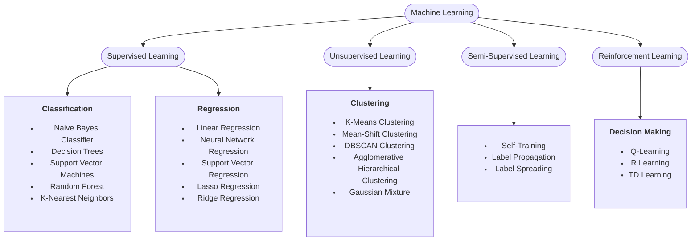
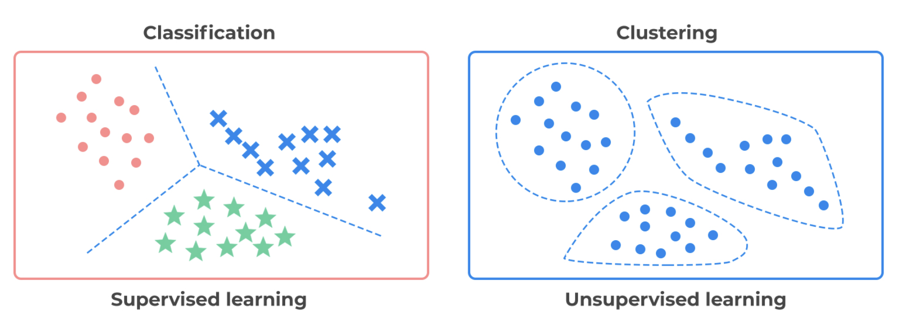

# Intro to Machine Learning

---
layout: center
---

But first, what is Machine Learning?

---
layout: center
---

> Machine learning is a subfield of computer science that focuses on building algorithms that rely on a collection of examples of some phenomenon. These examples may come from nature, be handcrafted by humans, or generated by another algorithm.

*The Hundred-Page Machine Learning Book*

---

## Types of Learning

### Supervised Learning
The dataset is a collection of labeled examples.

### Unsupervised Learning
The dataset is a collection of unlabeled examples.

### Semi-Supervised Learning
The dataset includes both labeled and unlabeled examples.

### Reinforcement Learning
The machine interacts with an environment to maximize rewards.

---

## Types of Learning

_This class will focus on **Supervised Learning** and **Unsupervised Learning** as those are the most common._

---

## Supervised vs Unsupervised Learning

---
layout: image-right
image: decks/08_machine_learning_introduction/image-3.png
backgroundSize: contain
---

## Semi-Supervised Learning

- Combines labeled and unlabeled data to improve model performance.
- Adding unlabeled examples can provide more information about the data distribution.

### Examples

- **Image Classification**: Using a few labeled images and many unlabeled images.
- **Speech Recognition**: Using a few labeled audio samples and many unlabeled audio samples.

---
layout: image-right
image: decks/08_machine_learning_introduction/image-4.gif
backgroundSize: contain
---

## Reinforcement Learning

- Involves a machine "living" in an environment, perceiving states, and executing actions to maximize rewards.
- Example applications: Game playing, robotics, resource management.

### Examples

- **Game Playing**: AlphaGo, OpenAI Five
- **Robotics**: Robotic arms, drones
- **AI Model Tuning:** DeepSeek-R1 is big in the news for this!
