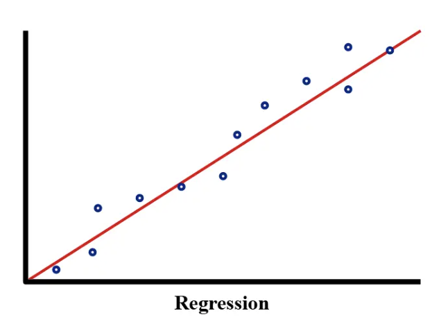
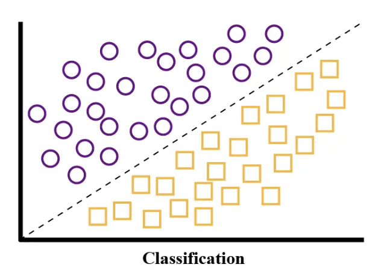
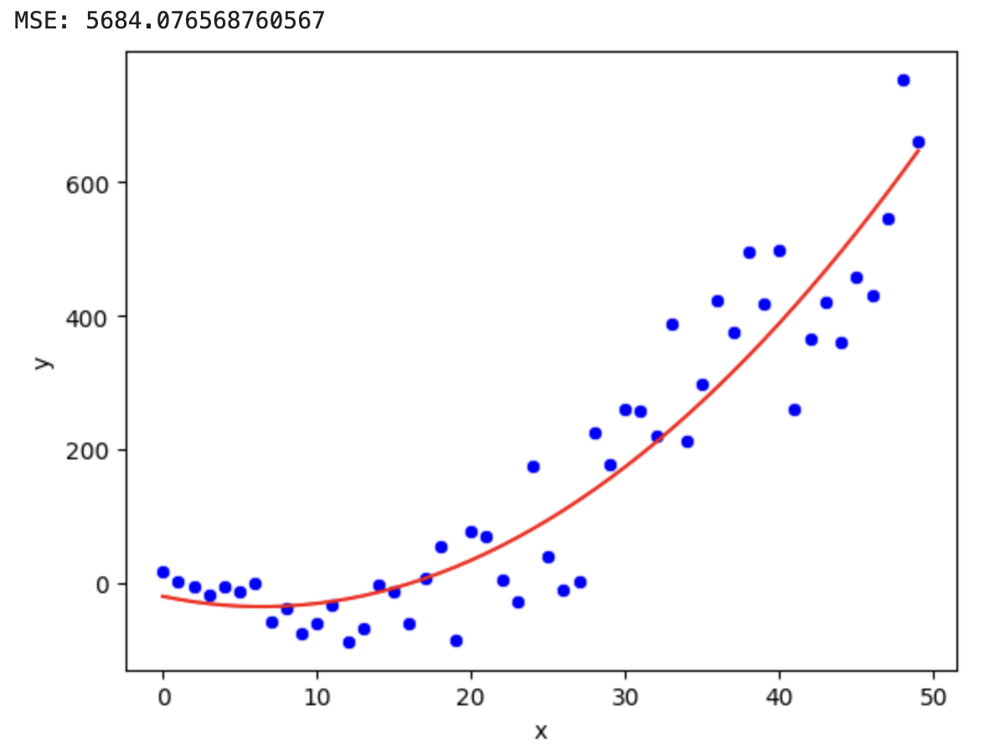
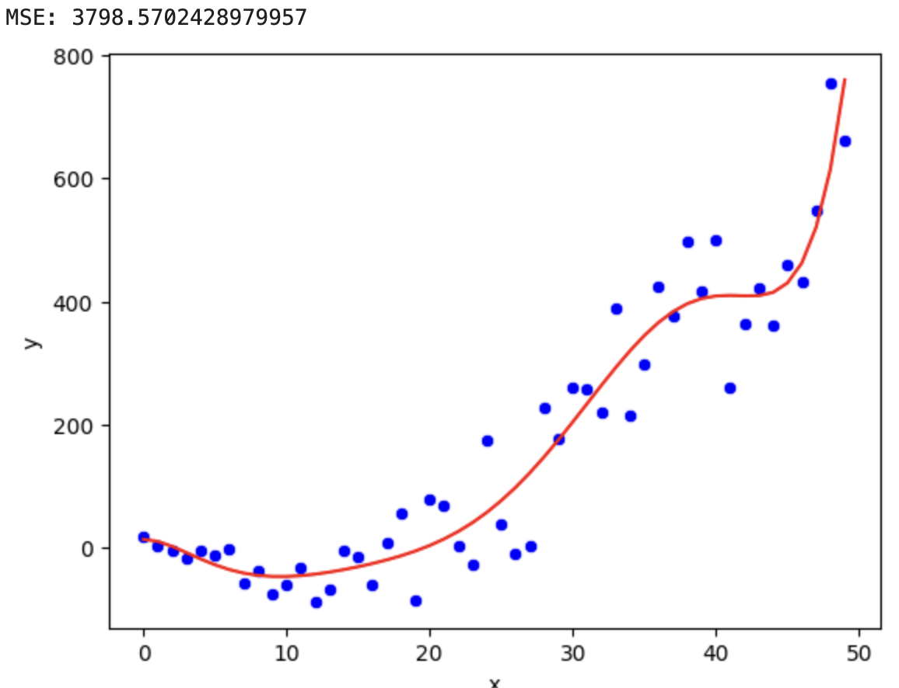
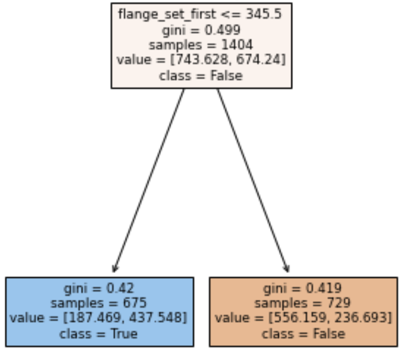

# Supervised Machine Learning

---
layout: two-cols-two-rows-header
---

## Supervised Learning

::left-top::

### Regression

In regression, the label is a **continuous numerical value**.

We frequently approximate or predict a target value (like housing prices, stock prices, etc.).

::left-bottom::

<!-- Image: A regression graph. -->
{width="50%"}

::right-top::

### Classification

In classification, the label is chosen from a **finite** set of **classes**.

**Binary Classification**: Two classes (e.g., True/False)

**Multiclass Classification**: More than two classes.

::right-bottom::

<!-- Image: A classifiation graph. -->
{width="50%"}

---
layout: image-right
image: decks/09_machine_learning_supervised/image-2.png
backgroundSize: contain
transition: fade
---

<!-- Image: A chase fraud email. -->

## Supervised Learning Examples

### Credit Card Fraud Detection
- **Features:** Vendor, location, time, distance from last transaction
- **Labels:** Chargebacks on previous transactions

**Question:** What kind of supervised learning?

1. Regression
2. <span v-mark="{ at: 1, color: 'orange', type: 'circle' }">Binary Classification</span>
3. Multiclass Classification

---
layout: image-right
image: decks/09_machine_learning_supervised/image.png
backgroundSize: contain
---

<!-- Image: A regression line over a stock market graph. -->

## Supervised Learning Examples

### Stock Market Prediction
- **Features:** Stock price from Feb 1st to March 1st
- **Labels:** Stock price on March 7th.

**Question:** What kind of supervised learning?

1. <span v-mark="{ at: 1, color: 'orange', type: 'circle' }">Regression</span>
2. Binary Classification
3. Multiclass Classification

---
layout: image-right
image: decks/09_machine_learning_supervised/image-4.png
backgroundSize: contain
transition: fade
---

<!-- Image: The Gmail inbox categories. -->

## Supervised Learning Examples

### Gmail Inbox Categories
- **Features:** Terms in the subject, body, origin email address
- **Labels:** "Primary", "Social", "Promotions", "Updates", "Forums"

**Question:** What kind of supervised learning?

1. Regression
2. Binary Classification
3. <span v-mark="{ at: 1, color: 'orange', type: 'circle' }">Multiclass Classification</span>


---
layout: section
hideInToc: true
---

# Supervised Regression

---
layout: image-right
image: decks/09_machine_learning_supervised/image-3-2.png
backgroundSize: contain
---

<!-- Image: A regression showing the resltionship between happiness and income. -->

## What is Linear Regression?

Linear regression is a **fundamental algorithm** in machine learning and can be thought of as simple supervised learning.

It models the relationship between a dependent variable $y$ and one or more independent variables $X$ by fitting a linear equation to the observed data.

For a simple model, we write it:

$$
y = w_0 + w_1 x
$$ 

- $y$: Dependent variable
- $x$: Independent variable
- $w$: A vector Coefficients

---
layout: image-right
image: decks/09_machine_learning_supervised/image-11.png
backgroundSize: contain
---

<!-- Image: A y=mx+b graph. -->

## You've Seen This Before!

In high school, you learned about the equation of a line:

$y = m x + b$

The only difference is that in machine learning, we use $w_0$ and $w_1$ instead of $m$ and $b$.

$y = w_0 + w_1 x$

That is...

$\mathbf{w} = \begin{bmatrix} w_0 \\ w_1 \\ \end{bmatrix} = \begin{bmatrix} m \\ b \\ \end{bmatrix}$


---
layout: image-right
image: decks/09_machine_learning_supervised/image.png
backgroundSize: contain
---

<!-- Image: A regression line over a stock market graph. -->

## Linear Regression Example

### Stock Market Prediction
- **Features:** Stock price from Feb 1st to March 1st
- **Labels:** Stock price on March 7th.

_In the example above, the linear regression model would learn the relationship between the stock prices over time and use that to predict future prices._

- $y$: Closing Price
- $x$: Date
- $w$: The trained coefficients

---
layout: image-right
image: decks/09_machine_learning_supervised/image-9.png
backgroundSize: contain
---

<!-- Image: A regression plane over a 3c space with y and x1 and x2 as axis -->

## Linear Doesn't Always Mean Line

We know that:

$y = w_0 + w_1 x$

But just as we think of $w$ as a vector, we can think of $y$ and $x$ as vectors and matrices.

$\mathbf{w} = \begin{bmatrix} 
w_0 \\ 
w_1 \\ 
\end{bmatrix}
\mathbf{y} = \begin{bmatrix} 
y_1 \\ 
y_2 \\ 
\vdots \\ 
y_n 
\end{bmatrix}, \quad 
\mathbf{X} = \begin{bmatrix} 
1 & x_{11} \\ 
1 & x_{21} \\ 
\vdots & \vdots \\ 
1 & x_{n1} 
\end{bmatrix}$

And now we can write the equation as:

$\mathbf{y} = \mathbf{X} \cdot \mathbf{w}$

---
layout: image-right
image: decks/09_machine_learning_supervised/image-4-2.png
backgroundSize: contain
---

<!-- Image: A plane visualized in 3d space. -->

## Multiple Linear Regression

- For multiple linear regression, the model includes multiple independent variables:
  $$
  y = w_0 + w_1 x_1 + w_2 x_2 + \ldots + w_p x_p + 
  $$
  - $x_1, x_2, \ldots, x_p$: Independent variables
  - $w_1, w_2, \ldots, w_p$: Coefficients

$$
\mathbf{y} = \begin{bmatrix} 
y_1 \\ 
y_2 \\ 
\vdots \\ 
y_n 
\end{bmatrix}, \quad 
\mathbf{X} = \begin{bmatrix} 
1 & x_{11} & x_{12} & \ldots & x_{1p} \\ 
1 & x_{21} & x_{22} & \ldots & x_{2p} \\ 
\vdots & \vdots & \vdots & \ddots & \vdots \\ 
1 & x_{n1} & x_{n2} & \ldots & x_{np} 
\end{bmatrix}, \quad 
\mathbf{w} = \begin{bmatrix} 
w_0 \\ 
w_1 \\ 
w_2 \\ 
\vdots \\ 
w_p 
\end{bmatrix}
$$

---

## In Code

```python
from sklearn.linear_model import LinearRegression

# Create a linear regression model
model = LinearRegression()

# Train the model
model.fit(X_train, y_train)

# Make predictions
y_pred = model.predict(X_test)
```

This is similar to saying:

$\texttt{y\_pred} = \texttt{X\_pred} \cdot w$

---
layout: image-right-invert
image: https://upload.wikimedia.org/wikipedia/commons/thumb/3/3a/Linear_regression.svg/450px-Linear_regression.svg.png
backgroundSize: contain
---

<!-- Image: A linear regression line over many points. -->

## Visualizing Linear Regression

- The line of best fit minimizes the vertical distances (errors) between the observed points and the predicted line.
- The sum of these squared distances is what we aim to minimize using the loss function.

---
layout: image-right
image: decks/09_machine_learning_supervised/image-12.png
backgroundSize: contain
---

<!-- Image: A graph showing error lines between the bars and the points. -->

## MSE Loss Function

* The goal of linear regression is to find the values of $w$ that minimize the difference between the observed and predicted values of $y$.
* We quantify this using a **loss function** called **Mean Squared Error (MSE)**, calculated as:

  $MSE = \frac{1}{N} \sum_{i=1}^{N} (y_i - \hat{y}_i)^2$

  - $y_i$: Actual value
  - $\hat{y}_i$: Predicted value
  - $N$: Number of observations

*All models have a loss function, to "fit" a model is to minimize the loss function.*

---
layout: image-right
image: decks/09_machine_learning_supervised/image-13.png
backgroundSize: contain
---

<!-- Image: A graph showing error lines between the bars and the points but with squares next to the bars to show error squared as area. -->

## Why <u>Squared Error</u> Instead of <u>Absolute Error</u>?

- Mean Absolute Error (MAE) is an alternative to MSE.

- By squaring the errors, we ensure they are always positive.

- MSE is differentiable, which makes it easier to optimize using gradient-based methods.

- **Squaring the errors emphasizes larger discrepancies, making the model more sensitive to outliers.**


---

## Fitting a Linear Regression

### Normal Equation

For small to medium-sized datasets, linear regression can be solved using simple matrix math:

$w = (X^T X)^{-1} X^T y$

Where:
- $X$: Matrix of input features
- $y$: Vector of output values

For larger datasets (and for other algorithms we'll go over later), **Gradient Descent** is used.

**For this class, we'll just use SKLearn.**

---
layout: image-right
image: decks/09_machine_learning_supervised/image-11-2.png
backgroundSize: contain
---

<!-- Image: A graph showing a polynomial regression curve. -->

## What is Polynomial Regression?

Many real-world relationships are not purely linear; polynomial regression allows us to capture curvature in the data.

A basic polynomial relationship might be:

$y = c_1 x + c_2 x^2$ + b

We can rewrite this as:

$y = w_0 + w_1x + w_2x^2$

_Notice that $x^2$ adds a non-linear effect._

But even though the relationship is polynomial in $x$, it remains linear in the coefficients $w$.

So we can solve it with the same techniques!

---

## From Multiple to Polynomial Regression

Polynomial regression is actually **multiple linear regression** using polynomial features.

Starting from multiple linear regression:

$y = w_0 + w_1 x_1 + w_2 x_2 + \dots + w_p x_p$

If we substitute:

$x_1 = x, \quad x_2 = x^2, \quad x_3 = x^3, \dots$

We get:

$y = w_0 + w_1 x + w_2 x^2 + w_3 x^3 + \dots + w_n x^n$

<!--
**Speaker Notes:**
- Clearly state that polynomial regression is a special case of multiple linear regression where each feature is a power of the original variable.
- Emphasize that it's still linear in parameters, so the same optimization methods apply.
-->

---

## Polynomial Regression Equation

The polynomial regression equation is:

$y = w_0 + w_1 x + w_2 x^2 + \dots + w_n x^n$

We represent polynomial features as:

$\mathbf{X} = \begin{bmatrix}
1 & x_1 & x_1^2 & \dots & x_1^n \\
1 & x_2 & x_2^2 & \dots & x_2^n \\
\vdots & \vdots & \vdots & \ddots & \vdots \\
1 & x_m & x_m^2 & \dots & x_m^n
\end{bmatrix}, \quad
\mathbf{w} = \begin{bmatrix}
w_0 \\ w_1 \\ w_2 \\ \vdots \\ w_n
\end{bmatrix}$

<!--
**Speaker Notes:**
- Reinforce that each column is just the original feature raised to higher powers.
- Highlight that the regression remains linear in terms of $w$, allowing standard linear regression techniques.
-->

---

## Plolynomial Regression Training

Similar to linear regression but with polynomial terms

Minimize the sum of squared errors (SSE)
    
$$
\text{minimize} \sum_{i=1}^{n} (y_i - (w_0 + w_1x_i + w_2x_i^2 + \cdots + w_nx_i^n))^2
$$

### Beware Overfitting!

High-degree polynomials can fit the training data perfectly but generalize poorly to new data.

The best way to avoid overfitting is with **regularization**. This is when we add a penalty term to the loss function that discourages large coefficients.


---
layout: three-cols-header
---

## Fitting a Regression

::left::

### Underfit

Model is too simple and misses the underlying pattern

<!-- Image: Underfit example. -->


::middle::

### Good Fit

Model captures the underlying pattern without noise

<!-- Image: Good fit example. -->


::right::

### Overfit

Model is too complex and captures noise

<!-- Image: Overfit example. -->


---
layout: image-right
image: /decks/09_machine_learning_supervised/image-26.png
backgroundSize: contain
---

## Real-World Example

Outer Wall Thickness of an extruded vinyl profile is measured and recorded manually using a cut profile and a pair of calipers once every 12 hours.

- If this wall is **too thin**, the profile will create failure points.
- If this wall is **too thick**, the profile will be too heavy and expensive.
- Customer is **losing $400K/mo** in overage.


---
layout: image-right
image: /decks/09_machine_learning_supervised/image-27.png
backgroundSize: contain
---

<!-- Image: Showing the scored results of the model. -->

### Metrics
- **Main Feed Speed**: Speed at which substrate material feeds into the main extruder.
- **Main Drive Amps**: Electrical load on the main extruder's motor.
- **Puller Speed**: Speed at which the product is pulled from the die.
- **Die and Barrel Zone Temperatures**: Temperature at the die and extruder barrel.

### Model
- Lasso Regression scored against a 60-minute rolling window
- Pre-aggregated data into 5-minute buckets of aggregates (feature engineering)

---
layout: section
hideInToc: true
---

# Supervised Classification

---
layout: three-cols-header
---

<!--
Images:
- The first image is an Eevee card with a move called "Tackle" that does 10 damage.
- The second image is an Eevee card with a move called "Quick Attack" that does 10 damage on a coin flip and 30 damage if heads.
- The third image is an Eevee card with a move called "Continuous Steps" that does requires the player to flip a coin until they get tails, dealing 20 damage for each heads.
-->

## Exercise

On average, which of the following Pokemon cards does the most damage? Write your answer in chat.

::left::


::middle::


::right::


---
layout: section
hideInToc: true
---

## A Brief Interlude into Probability

---
layout: image-right
image: https://assets.tcgdex.net/en/tcgp/A2/126/low.webp
backgroundSize: contain
---

<!--
Images:
- The image is an Eevee card with a move called "Quick Attack" that does 10 damage on a coin flip and 30 damage if heads.
-->

## Expected Value

**Expected Value** is a way to measure the average outcome of a random variable.

For example, “What’s the expected value of a standard die roll?” you’d add its possible outcomes and divide by 6:

$$
\mathbb{E}[\text{die}] = \frac{1 + 2 + 3 + 4 + 5 + 6}{6} = 3.5
$$

Using this, we can answer:

$$
\begin{split}
\begin{align*}
\mathbb{E}[\text{Quick Attack}] &= \left(\frac{1}{2}\right) \times 30
+ \left(\frac{1}{2}\right) \times 10 \\
&= 15 + 5 \\
&= 20
\end{align*}
\end{split}
$$

---
layout: image-right
image: /decks/09_machine_learning_supervised/image-16.png
backgroundSize: contain
---

<!--
Images:
- The image is a tree of coin flips with the probabilities of heads and tails.
-->

## Multiplication Rule

The probability of something happening is denoted as:

$P(\text{event})$

Two independent events have a joint probability:

$P(A \cap B) = P(A) \times P(B)$

For example, if the probability of flipping a coin on heads once is 1/2 than the probability of flipping it twice and getting heads both times is:

$P(\text{heads}) \times P(\text{heads}) = 1/2 \times 1/2 = 1/4$

---
layout: image-right
image: https://assets.tcgdex.net/en/tcgp/A1a/061/low.webp
backgroundSize: contain
---

<!-- 
Images:
- The image is an Eevee card with a move called "Continuous Steps" that does requires the player to flip a coin until they get tails, dealing 20 damage for each heads.
-->

## Multiplication Rule

Considering the probabilities of flipping a coin _until_ we get tails:

$$
\begin{split}
\begin{align*}
P(T) &= \tfrac{1}{2} \\
P(HT) &= \tfrac{1}{2} \times \tfrac{1}{2} = \tfrac{1}{4} \\
P(HHT) &= \ldots
\end{align*}
\end{split}
$$

We can sum these probabilities together until $\infty$ as a geometric series which converges to 1:

$$
\sum_{k=0}^{\infty} k \left(\frac{1}{2}\right)^{k+1} = 1.
$$

Therefore:

$$
\mathbb{E}[\text{Cont. Steps}]
= 20 \times 1
= 20
$$

---
layout: image-right
image: /decks/09_machine_learning_supervised/image-17.png
backgroundSize: contain
---

<!--
Images:
- The image is a tree of probabilities of if someone would play Tennis or not based on the weather.
- The first branch is "Sunny" with a probability of 0.6 and the second branch is "Rainy" with a probability of 0.4.
- The second level branches are "Yes" and "No" with probabilities of 0.9 and 0.1 for Sunny and 0.05 and 0.95 for Rainy.
-->

## Conditional Probability

The probability of the positive class y given some non-independent event x is denoted as:

$P(y=1|x)$

Bayes' theorem relates the probability of the positive class to the likelihood and prior probability:

$P(y=1|x) = \frac{P(x|y=1)P(y=1)}{P(x)}$

---

## COVID-19 Infection Example

**Question**: I have a cough, what's the likelihood I have COVID-19?

- $P(y=1)$: Prior probability of having COVID-19 (e.g., infection rate in the population)
- $P(x|y=1)$: Likelihood of having symptoms given that you have COVID-19
- $P(x)$: Probability of observing the symptoms (e.g., general probability of being sick)

Using Bayes' theorem:
$$
P(\text{COVID}|\text{symptoms}) = \frac{P(\text{symptoms}|\text{COVID}) \cdot P(\text{COVID})}{P(\text{symptoms})}
$$

---

### Example Calculation

**Suppose:**
- $P(\text{COVID}) = 0.05$ (5% of the population is infected)
- $P(\text{symptoms}|\text{COVID}) = 0.90$ (90% of infected people show symptoms)
- $P(\text{symptoms}) = 0.20$ (20% of the population shows symptoms)

**Then:**

$$
P(\text{COVID}|\text{symptoms}) = \frac{0.90 \times 0.05}{0.20} = \frac{0.045}{0.20} = 0.225
$$

**Interpretation:**

_Given that you have symptoms, there is a **22.5% probability that you have COVID-19**._


---
layout: section
hideInToc: true
---

# Logistic Regression

---
layout: image-right
image: decks/09_machine_learning_supervised/image-2.png
backgroundSize: contain
---

<!--
Images:
- The image shows a screenshot of a Chase credit card fraud email
-->

## Logistic Regression

Logistic regression is used for **binary classification** problems (e.g., is this email spam or not?).

It models the probability that a given input $x$ belongs to a particular category (often “positive” vs. “negative”).


### Credit Card Fraud Detection
**Features:** Vendor, location, time, distance from last transaction

**Labels:** Chargebacks on previous transactions

**Modeled Relationship:** The probability of a transaction being fraudulent.


---
layout: image-right
image: /decks/09_machine_learning_supervised/image-17.png
backgroundSize: contain
---

## From Bayes to Regression

Bayes' theorem gives us the probability of class given features:

$P(y=1|x) = \frac{P(x|y=1)P(y=1)}{P(x)}$

**But what if we don't explicitly know these probabilities?**

Logistic regression helps us learn these directly from data:

 Instead of estimating probabilities explicitly, we model the **log-odds** as a linear function:

$\log\frac{P(y=1|x)}{1 - P(y=1|x)} = w_0 + w_1 x_1 + \dots + w_p x_p$

Then, the logistic function converts log-odds to a probability.

<!--
**Speaker Notes:**
- Clearly explain the limitation of directly using Bayes: we usually don’t know all underlying probabilities.
- Logistic regression circumvents this by directly modeling the relationship between features and the odds of class membership.
-->


---
layout: image-right
image: decks/09_machine_learning_supervised/image-9-2.png
backgroundSize: contain
---

<!--
Images:
- The image is a graph of the logistic function.
-->

## Logistic Function

We transform linear combinations of features to probabilities using the **logistic (sigmoid) function**:

$P(y=1 \mid x) = \sigma(z) = \frac{1}{1 + e^{-z}}$

Where:

$\quad z = w_0 + w_1 x_1 + \dots + w_p x_p$

- $z$: Linear combination of features.
- $\sigma(z)$: Probability between 0 and 1.

**While $z$ can take any value, the output of $\sigma(z)$ is always between 0 and 1.**

<!--
**Speaker Notes:**
- Clarify that logistic regression outputs probabilities (0 to 1) rather than continuous numeric values.
- Emphasize the intuitive interpretation of outputs as probabilities.
-->

---
layout: image-right
image: decks/09_machine_learning_supervised/image-10-2.png
backgroundSize: contain
---

<!--
Images:
- The image is a graph of the logistic function with the decision boundary.
-->

### Decision Boundary

The decision boundary is defined where the model predicts $P(y=1 \mid x) = 0.5$.

Equivalently, $\sigma(z) = 0.5$ $\rightarrow$ $z=0$.

### Loss Function and Optimization

Uses the **Cross-Entropy Loss** (also called Log Loss).

Parameters ($w_i$) are optimized using **gradient descent** to minimize this loss.

---
layout: two-cols
---

## Odds and Log-Odds

### Odds

The ratio of the probability of an event to the probability of not the event.

$\text{Odds} = \frac{P(y=1 \mid x)}{1 - P(y=1 \mid x)}$

### Log-Odds (Logit)

The natural logarithm of the odds.

$\text{Log-Odds} = \log\left(\frac{P(y=1 \mid x)}{1 - P(y=1 \mid x)}\right)$

Logistic regression is linear in the **log-odds** space:

$\log\left(\frac{P(y=1 \mid x)}{1 - P(y=1 \mid x)}\right) = w_0 + w_1 x_1 + \cdots + w_p x_p$

::right::

## Interpretation of Coefficients

Each coefficient $w_i$ represents how the **log-odds** of the positive class changes with respect to a one-unit change in $x_i$.

| Coefficient | Interpretation |
|-------------|----------------|
| $w_i > 0$   | Increasing $x_i$ increases the log-odds (increasing probability) |
| $w_i < 0$   | Increasing $x_i$ decreases the log-odds (decreasing probability) |

---
layout: image-right
image: decks/09_machine_learning_supervised/image-18.png
backgroundSize: contain
---

<!--
Images:
- The image is a graphic showing the how Precision and Recall are calculated.
-->

## Measuring Performance

### Accuracy

Layman friendly. Can be misleading for imbalanced datasets.

$\text{Accuracy} = \frac{\text{Correct Predictions}}{\text{Total Predictions}}$

<!-- Example of accuracy not working well, credit card transactions where most are valid. -->

### Precision and Recall

Less intuitive but more informative for imbalanced datasets.

$\text{Precision} = \frac{\text{True Positives}}{\text{True Positives} + \text{False Positives}}$


$\text{Recall} = \frac{\text{True Positives}}{\text{True Positives} + \text{False Negatives}}$


---
layout: section
hideInToc: true
---

# Training a Supervised Learning Model

---
layout: image-right
image: decks/09_machine_learning_supervised/image-5.png
backgroundSize: contain
---

<!--
Images:
- The image is a diagram showing a dataset cut into features and labels.
-->

## (1) Feature / Label Split

- **Features**: Input data used to make predictions (usually multiple columns).
- **Labels**: Output data to predict (usually a single column).

<br>

```python
# Load data
df = pd.read_csv('data.csv')

# Split features and labels
X = df.drop(columns=['label'])
y = df['label']
```

---
layout: image-right
image: decks/09_machine_learning_supervised/image-3.png
backgroundSize: contain
---

<!--
Images:
- The image is a diagram showing a dataset cut into training and test sets.
-->

## (2) Train / Test Split

- **Training Set**: Used to train the model.
- **Test Set**: Used to evaluate the model's performance.

**With Pandas**
```python
# Create a train/test split mask
is_train = np.random.rand(len(X)) < 0.8

# Split data
X_train, y_train = X[is_train], y[is_train]
X_test, y_test = X[~is_train], y[~is_train]
```

**With Sklearn**
```python
from sklearn.model_selection import \
    train_test_split

X_train, X_test, y_train, y_test = \
    train_test_split(X, y, test_size=0.2)
```

---
layout: image-right
image: decks/09_machine_learning_supervised/image-19.png
backgroundSize: contain
---

<!--
Images:
- The image is a time series graph of with a cut into training and test sets.
-->

## Deciding the Split Method

#### Random Split
Shuffle the dataset randomly, then allocate a percentage for training and the remaining for testing.

**When to Use**: Independent and identically distributed (i.i.d.) data.

#### Time-Based Split
The model must predict future events based past data. We split chronologically (e.g., train on 2000 to 2020, test on 2020 to 2025.)

**When to Use**: Time-series, sequential data.

#### Other Splits

Stratified Split, Group Split, Cross-Validation

---
layout: image-right
image: decks/09_machine_learning_supervised/image-6.png
backgroundSize: contain
---

<!--
Images:
- The image is a diagram showing the steps of training a model.
-->

## (3) Model Training

- **Choose a Model**: Select an algorithm that fits the problem.
- **Fit the model**: Train the model on the training data.
- **Exclude the Test Set**: The model should not see the test set during training.

<br>

```python
from sklearn.linear_model import \
    LinearRegression

model = LinearRegression()
model.fit(X_train, y_train)
```

---
layout: image-right
image: decks/09_machine_learning_supervised/image-8.png
backgroundSize: contain
---

<!--
Images:
- The image is a diagram showing evaluation of a model.
-->

## (4) Model Evaluation

- **Predict**: Use the model to make predictions on the test features.
- **Evaluate**: Compare predicted labels to the test labels with an evaluation metric.

#### Regression Evaluation

```python
from sklearn.metrics import mean_squared_error
y_pred = model.predict(X_test)
mse = mean_squared_error(y_test, y_pred)
print(f'Regression Mean Squared Error: {mse}')
```

#### Classification Evaluation

```python
from sklearn.metrics import accuracy_score
y_pred = model.predict(X_test)
accuracy = accuracy_score(y_test, y_pred)
print(f'Classification Accuracy: {accuracy}')
```

_Different evaluation metrics are used for regression and classification problems._


---
layout: header-link
---

## Exercise

https://shorturl.at/bhspV

---
layout: section
hideInToc: true
---

# Machine Learning in Production

---
layout: image-right
image: /decks/09_machine_learning_supervised/02-Predictive-Analytics-Monitoring_v5-800w.gif
backgroundSize: contain
---

## Lifecycle of an Updating Predictive Model

1. **Model Development**: Train a model on historical train set.
2. **Model Evaluation**: Assess the model's performance on historical test set.
3. **Model Deployment**: Integrate the model into a system or application.
4. **Model Monitoring**: Track the model's performance over time.
5. **Model Updates**: Update the model as needed.

---
layout: image
image: decks/09_machine_learning_supervised/Untitled_Artwork\ 6.png
backgroundSize: contain
---

---
layout: section
hideInToc: true
---

# Decision Trees

---
layout: image-right
image: decks/09_machine_learning_supervised/image-1-1.png
backgroundSize: contain
---

## What is a Decision Tree?

A decision tree is a flowchart-like structure used for classification and regression tasks.

It recursively splits the dataset into subsets based on feature values, forming a tree of decisions.

---
layout: image-right
image: decks/09_machine_learning_supervised/image-2-1.png
backgroundSize: contain
---

## Decision Tree Prediction

- **Objective**: Predict the class label of an instance based on its feature values.

- **Input**: Numerical or categorical features and class labels.

- **Output**: A decision tree that classifies instances into predefined classes.

<br>

```python
X = pd.DataFrame({
  "num_legs": [4],
  "num_eyes": [2],
})
print(model.score(X))
```
```
dog
```

---
layout: image-right
image: decks/09_machine_learning_supervised/image-28.png
backgroundSize: contain
---

## Decision Trees are Intuitive

**Interpretability**: Easy to understand and visualize.

**Feature Selection**: Automatically selects important features.

**Non-Parametric**: No assumptions about the underlying data distribution.

### Titanic Example

- Identifies Gender as most important feature
- Following the tree predicts the survival probability
- Leaf nodes contain the class label ("survived" or "died")

---
layout: image-right
image: decks/09_machine_learning_supervised/image-2-1.png
backgroundSize: contain
---

## Portability

Decision trees can be easily transferred to other formats (e.g., rules) for use in other systems.

```python
def predict(x):
    num_legs = x["num_legs"]
    num_eyes = x["num_eyes"]
    if num_legs >= 3:
        if num_eyes >= 3:
            return "spider"
        else:
            return "dog"
    else:
        return "penguin"
```

---
layout: image-left
image: decks/09_machine_learning_supervised/image-22.png
backgroundSize: contain
---



---
layout: image-left
image: decks/09_machine_learning_supervised/image-22.png
backgroundSize: 88%
---

```sql
WHERE
  (
    (hot_od_nom_first < 0.339) AND (zone_1_set_br > 0.614)
  ) -- class: True (proba: 72.32%) based on 4,707 samples
  OR (
    (hot_od_nom_first < 0.339) AND (zone_1_set_br < 0.615) AND (zone_1_set_br < -0.631)
  ) -- class: True (proba: 69.91%) based on 4,395 samples
  OR (
    (hot_od_nom_first > 0.338) AND (hot_od_nom_first > 0.374) AND (flange_set_first > 352.5)
  ) -- class: True (proba: 66.17%) based on 1,644 samples
  OR (
    (hot_od_nom_first > 0.338) AND (hot_od_nom_first > 0.374)
    AND (flange_set_first < 352.501) AND (set_1_ldr_first > 47.25)
    AND (hot_od_nom_first < 0.395)
  ) -- class: True (proba: 54.66%) based on 1,039 samples
  OR (
    (hot_od_nom_first > 0.338) AND (hot_od_nom_first > 0.374)
    AND (flange_set_first < 352.501) AND (set_1_ldr_first < 47.251)
  ) -- class: True (proba: 63.52%) based on 975 samples
  OR (
    (hot_od_nom_first > 0.338) AND (hot_od_nom_first < 0.375)
    AND (hot_od_nom_first < 0.353) AND (flange_set_first < 345.501)
  ) -- class: True (proba: 70.01%) based on 675 samples
  OR (
    (hot_od_nom_first > 0.338) AND (hot_od_nom_first > 0.374)
    AND (flange_set_first < 352.501) AND (set_1_ldr_first > 47.25)
    AND (hot_od_nom_first > 0.394) AND (zone_1_set_br < -1.025)
  ) -- class: True (proba: 67.5%) based on 288 samples
  OR (
    (hot_od_nom_first > 0.338) AND (hot_od_nom_first > 0.374)
    AND (flange_set_first < 352.501) AND (set_1_ldr_first > 47.25)
    AND (hot_od_nom_first > 0.394) AND (zone_1_set_br > -1.026)
    AND (zone_1_set_br > 1.008)
  ) -- class: True (proba: 66.57%) based on 283 samples
```

---

## Tree Construction

- **Step 1**: Start with the entire dataset at the root.
- **Step 2**: Select the best feature to split the data based on **the chosen criterion**.
- **Step 3**: Split the data into subsets.
- **Step 4**: Recursively apply steps 2 and 3 to each subset.
- **Step 5**: Stop splitting when a stopping condition is met (e.g., maximum depth, minimum instances per node).

---
layout: image-right
image: decks/09_machine_learning_supervised/image-23.png
backgroundSize: contain
---

## Splitting Criteria -  Gini Impurity

- Measures the impurity of a node. Lower values indicate purer nodes.
- Gini impurity for a node with classes $1, 2, \ldots, C$:
  $$
  G = \sum_{i=1}^C p_i (1 - p_i)
  $$
  where $p_i$ is the proportion of instances of class $i$ in the node.

---
layout: image-right
image: decks/09_machine_learning_supervised/image-21.png
backgroundSize: contain
---

## Splitting Criteria -  Entropy

- Measures the randomness in the node. Lower values indicate less randomness.
- Entropy for a node with classes $1, 2, \ldots, C$:
  $$
  H = -\sum_{i=1}^C p_i \log(p_i)
  $$
  where $p_i$ is the proportion of instances of class $i$ in the node.

---
layout: image-right
image: decks/09_machine_learning_supervised/image-24.png
backgroundSize: contain
---

## Splitting Criteria - Information Gain

- Measures the reduction in entropy after a split.
- Information Gain for a split $S$:
  $$
  IG(S) = H(\text{parent}) - \sum_{j} \frac{|S_j|}{|S|} H(S_j)
  $$
  where $H(\text{parent})$ is the entropy of the parent node, $S_j$ are the subsets formed by the split, and $|S_j|$ is the number of instances in subset $S_j$.

---
layout: image-right
image: decks/09_machine_learning_supervised/image-25.png
---

## Pruning

Reduce overfitting by removing branches.

**Pre-pruning**: Stop growing the tree early.

- Maximum depth.
- Minimum instances per node.

**Post-pruning**: Grow the tree but then remove branches that don't provide significant power.

- **Cost Complexity:** Add a penalty for tree complexity to the cost function:

  $R_\alpha(T) = R(T) + \alpha |T|$

  Where $R(T)$ is the misclassification rate of tree $T$, $\alpha$ is a complexity parameter, and $|T|$ is the number of leaves.

---
layout: header-link
---

## Exercise

[https://shorturl.at/HT39Z](https://shorturl.at/HT39Z)
